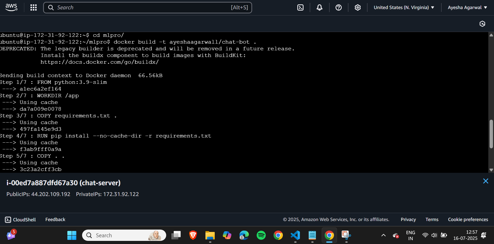
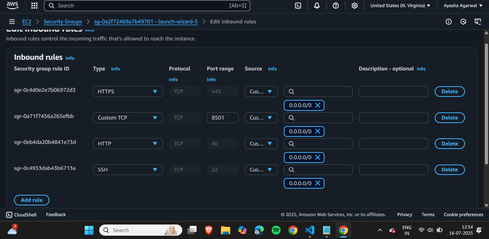
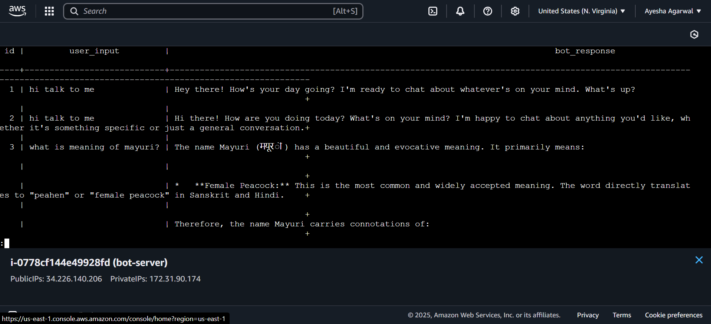
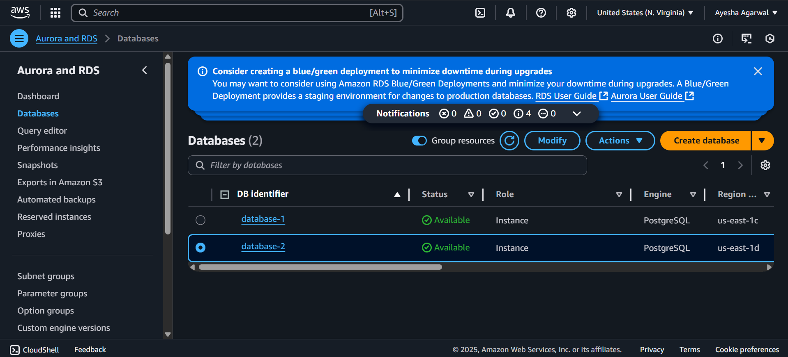
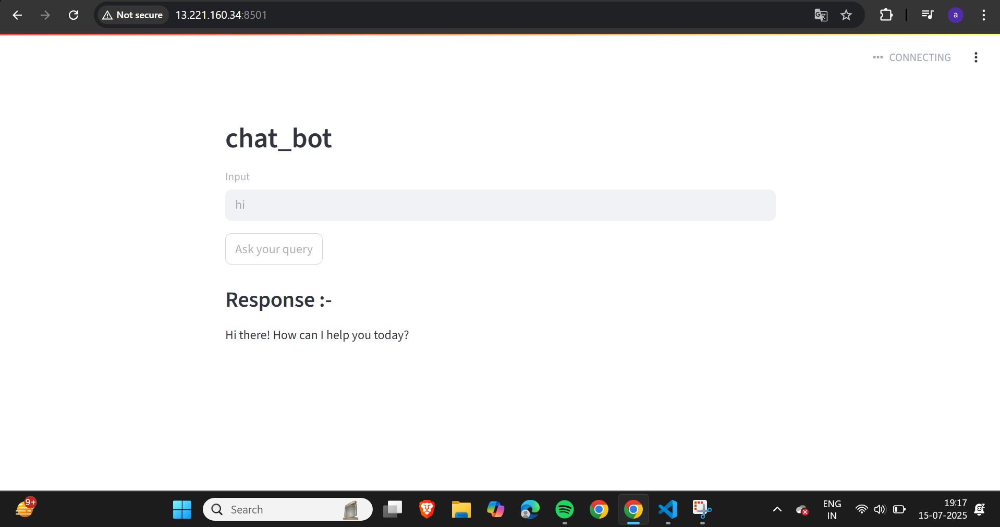
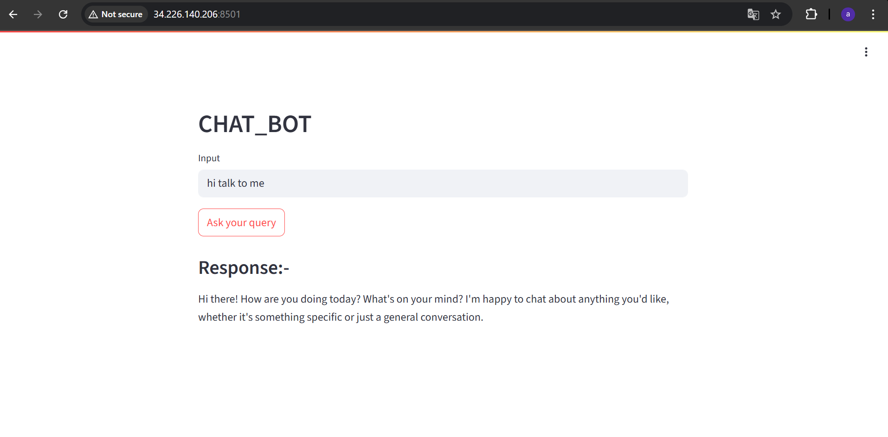

# 🤖 AI Chatbot (Streamlit)

This project is an AI-powered chatbot built using Python and Streamlit with integration of the Google Gemini API and PostgreSQL database.

---

## 🚀 Features

* Interactive chatbot interface
* AI-generated responses using Gemini API
* Backend logging with PostgreSQL (AWS RDS)
* Error handling for API and database failures
* Clean and stable UI (no crashes)

---

## 🌐 Live Demo

👉 https://your-app-name.streamlit.app

---

## ⚠️ Important Note

* The deployed (live) version runs **without database logging**.
* This is because the PostgreSQL database is hosted on AWS RDS and is **not publicly exposed** for security reasons.
* The application is designed to **gracefully handle database unavailability**, so it continues to function without crashes.

👉 In the full environment (local/AWS deployment), the chatbot:

* Connects to AWS RDS
* Stores user queries and responses successfully
* Runs fully using Docker

---

## 🐳 AWS + Docker Setup (Full Version)

In the complete setup:

* The application is containerized using Docker
* Connected to AWS RDS database
* Fully functional with logging enabled

---

## 📸 Screenshots

### 🔹 AWS + Docker Working Setup






### 🔹 Application UI




---

## 🛠️ Tech Stack

* Python
* Streamlit
* Google Gemini API
* PostgreSQL (AWS RDS)
* Docker

---

## 📂 Run Locally

```bash
pip install -r requirements.txt
streamlit run app.py
```

---

## 💡 Note

This project demonstrates real-world deployment considerations such as:

* handling API rate limits
* managing secure database connections
* ensuring application stability even when external services are unavailable
